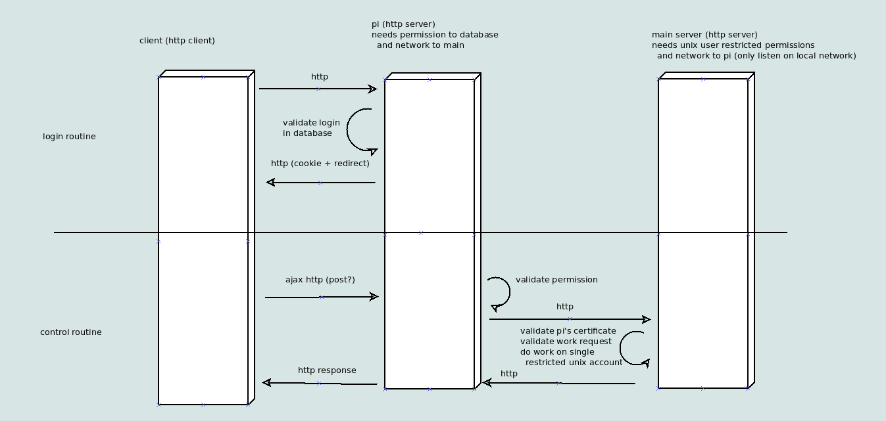

# Pi Site

This is a personal project enabling remote control of an intermittently-powered "main" server using an always-on Raspberry Pi as a relay. The original motivation was to be able to spin up various game servers/tasks on demand without needing to keep the server powered on at all times.

## Progress

The project is in a state of general disarray. I went through several iterations of design choices, since I didn't quite understand modern web development at the beginning of the project. My priorities shifted towards other projects while figuring out the frontend, so there hasn't been that much work done there. Most of the work was done irregularly between Feb 2021 and Jun 2021. I'd like to revisit this project if time allows, but unfortunately I'm pretty bogged down with university work.

**This project isn't anywhere near completion, so please don't attempt to use it in production.**

- [ ] pi
  - [x] authentication
    - [x] login
    - [x] logout
    - [ ] change password (needs to be reworked)
  - [ ] administration (needs to be reworked)
  - [x] forward requests
  - [x] get main power status
- [ ] main 
  - [x] minecraft server control
  - [x] minecraft dynmap
  - [ ] left 4 dead 2
  - [ ] ???
- [ ] Frontend

## Design 

The current overall design is as follows:

The current technology stack is:
- Backend
  - Python 3
  - Flask
  - SQLAlchemy
- Frontend
  - Javascript 
  - React

Unorganized design and implementation notes are location in [notes.txt](notes.txt)

### Old Design

- static website with server-side processing
- shells scripts to run tasks on main server
- scripts would be located in a user's home folder
- authentication would be done the Linux/UNIX login system

## License
AGPLv3+
